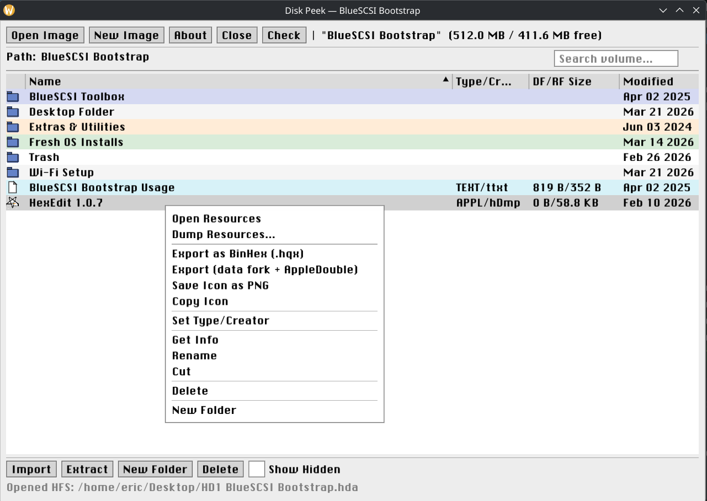

# Disk Peek

A cross-platform GUI application for browsing and managing classic Macintosh HFS and HFS+ disk images. Build and inspect disk images for [BlueSCSI](https://bluescsi.com) and classic Macintosh hardware.



## Features

- Browse HFS and HFS+ disk image files
- Navigate folder hierarchies with a classic Mac-inspired interface
- View file metadata: type, creator, sizes, dates, Finder flags
- Custom icon display extracted from resource forks
- **Resource Browser** (ResEdit-style) — double-click any file to explore its resources:
  - View icons (cicn, ICN#, icl4, icl8, SICN, ICON, icns, PICT, cursors, patterns)
  - Play sounds (snd, csnd, esnd)
  - Read text (STR, STR#, TEXT, vers)
  - Inspect dialogs, menus, windows (DLOG, DITL, MENU, WIND, CNTL)
  - Hex dump for everything else
  - Export individual or batch-export all resources of a type (WAV, PNG, TXT)
- Export files as BinHex (.hqx) or data fork + AppleDouble
- Import files from the host filesystem
- Create, rename, and delete files and folders
- Set file type and creator codes (with auto-detection)
- Create new blank HFS disk images
- Volume integrity checking

## Download

Pre-built binaries are available on the [Releases](https://github.com/erichelgeson/diskpeek/releases) page:

| Platform | Download |
|----------|----------|
| Linux (AppImage) | `diskpeek-linux-x86_64.zip` |
| macOS (Apple Silicon) | `diskpeek-macOS-aarch64.zip` |
| macOS (Intel) | `diskpeek-macOS-x86_64.zip` |
| Windows | `diskpeek-windows-x86_64.zip` |

### Linux

Download the zip, extract the AppImage, make it executable, and run:

```bash
chmod +x diskpeek-x86_64.AppImage
./diskpeek-x86_64.AppImage
```

### macOS

Download the zip, extract the binary, make it executable, and run:

```bash
chmod +x diskpeek-macOS-aarch64
./diskpeek-macOS-aarch64
```

> Note: You may need to right-click and select "Open" the first time, or run `xattr -cr diskpeek-macOS-*` to clear the quarantine flag.

### Windows

Download the zip and extract all files to a folder. Run `diskpeek-windows-x86_64.exe`. The DLLs must remain alongside the executable.

## Building from Source

### NixOS / Nix

```bash
nix develop
meson setup builddir
ninja -C builddir
./builddir/hfsbrowser
```

### Ubuntu / Debian

```bash
sudo apt install meson ninja-build libsdl3-dev libgl-dev zlib1g-dev
meson setup builddir
ninja -C builddir
```

### macOS

```bash
brew install meson ninja sdl3
meson setup builddir
ninja -C builddir
```

## Architecture

Three-layer design:

1. **GUI layer** (`gui/`) — C++23, Dear ImGui with SDL3/OpenGL3 backend
2. **libhfs** (`libhfs/`) — Classic HFS filesystem library (Robert Leslie, 1996-1998)
3. **libdmg-hfsplus** (`lib/libdmg-hfsplus/`) — HFS+ filesystem library

The Resource Browser uses vendored copies of:
- [resource_dasm](https://github.com/fuzziqersoftware/resource_dasm) (MIT) — Mac resource fork parser with 100+ resource decoders
- [phosg](https://github.com/fuzziqersoftware/phosg) (MIT) — Utility library for binary I/O and images

## Credits

| Library | Author | License |
|---------|--------|---------|
| hfsutils | Robert Leslie (1996-1998) | GPLv2+ |
| libdmg-hfsplus | planetbeing (David Wang) | GPLv3 |
| Dear ImGui | Omar Cornut | MIT |
| SDL3 | Sam Lantinga / libsdl.org | zlib |
| resource_dasm | Martin Michelsen | MIT |
| phosg | Martin Michelsen | MIT |

## License

This project is licensed under the **GNU General Public License v3** (GPLv3). See [COPYING](COPYING) for details.

The original hfsutils library is GPLv2-or-later (compatible with GPLv3). libdmg-hfsplus is GPLv3. The combined work is therefore GPLv3. The vendored resource_dasm and phosg libraries are MIT licensed. Dear ImGui is MIT licensed. SDL3 is zlib licensed.

The original hfsutils library and documentation are by Robert Leslie. See [README.hfsutils.orig](README.hfsutils.orig) for the original project information.
